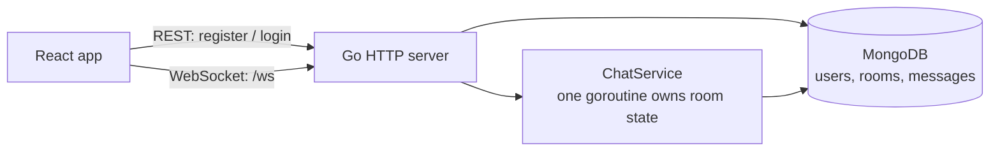

# GoChat

A real-time, multi-room chat app with a Go WebSocket server and a React frontend. Users sign up, pick a room, and chat live with everyone else in it.

I built it to learn how real-time servers work: long-lived connections, concurrency in Go, and keeping shared state consistent while many clients read and write at once.

## Features

- **Live chat over WebSockets:** messages show up instantly for everyone in the room.
- **Multiple rooms:** pick one of the built-in rooms or join any custom room by name. New rooms are created the first time someone joins.
- **Who's online:** each room shows the users currently in it, updated as people join and leave.
- **Message history:** the last 50 messages load when you join a room. All messages are stored in MongoDB.
- **Accounts:** sign up and log in. Passwords are hashed with bcrypt, and logins use JWTs that expire after 24 hours.
- **Automatic reconnect:** the client tries to reconnect up to 5 times if the connection drops.

## Tech stack

| | |
|---|---|
| **Backend** | Go, [gorilla/websocket](https://github.com/gorilla/websocket), `net/http`, JWT (`golang-jwt`), bcrypt |
| **Frontend** | React (Create React App) |
| **Database** | MongoDB |

## How it works



**Concurrency model**

- **Each connection gets two goroutines.** One reads messages from the client. The other is the only one that writes to the socket, because gorilla/websocket allows only one writer per connection. Replies, broadcasts and keepalive pings all go through a queue to that writer.
- **One goroutine owns the room state.** Joins, leaves and broadcasts go through channels to a single `ChatService` loop, so the room maps are never changed from two places at once.
- **Slow clients can't hold up everyone else.** Each client has a 256-message send queue. If a client falls that far behind, the server disconnects it instead of blocking the broadcast.
- **Dead connections are cleaned up.** The server pings every 54 seconds and drops connections that don't answer within 60.

**Security basics**

- The server refuses to start without a strong `JWT_SECRET`, which must be at least 32 characters.
- CORS and the WebSocket origin check allow only the frontend addresses listed in `ALLOWED_ORIGINS`.
- The server checks input: usernames are 3–30 letters, numbers or underscores, passwords 6–72 characters, messages up to 1,000 characters.

## Running it locally

**Prerequisites:** Go 1.23+, Node.js 18+, and MongoDB.

### 1. Start MongoDB

```bash
# macOS (Homebrew)
brew tap mongodb/brew && brew install mongodb-community
brew services start mongodb-community

# or with Docker
docker run -d --name gochat-mongo -p 27017:27017 mongo:7
```

You can also use a free [MongoDB Atlas](https://www.mongodb.com/atlas) cluster. If you do, set `MONGO_URI` to its connection string.

### 2. Start the backend

```bash
cd backend
cp .env.example .env
# Set JWT_SECRET in .env (required). Generate one with:
#   openssl rand -base64 48
go run .
```

The server listens on `http://localhost:8080`.

| Variable | Required | Default | Purpose |
|---|---|---|---|
| `JWT_SECRET` | **yes** | — | Signs login tokens. At least 32 characters. |
| `MONGO_URI` | no | `mongodb://localhost:27017` | MongoDB connection string |
| `PORT` | no | `8080` | Port the server listens on |
| `ALLOWED_ORIGINS` | no | `http://localhost:3000` | Comma-separated frontend addresses allowed to connect |

### 3. Start the frontend

```bash
cd frontend
cp .env.example .env
npm install
npm start
```

The app opens at `http://localhost:3000`.

| Variable | Default | Purpose |
|---|---|---|
| `REACT_APP_API_BASE_URL` | `http://localhost:8080` | Backend address, used for both the API and the WebSocket. It's included in the app when it's built, so set it before `npm run build`. |

### 4. Try it

Register two accounts and log in to each in a separate browser window (use a private window for the second one), join the same room, and chat.

## API

| Method | Path | Description |
|---|---|---|
| `POST` | `/api/auth/register` | Create an account and get a token |
| `POST` | `/api/auth/login` | Log in and get a token |
| `POST` | `/api/auth/validate` | Check a token (`Authorization: Bearer <token>`) |
| `POST` | `/api/auth/refresh` | Get a new token (`Authorization: Bearer <token>`) |
| `GET` | `/api/health` | Health check |
| `GET` | `/api/info` | Lists the endpoints and message types |
| `WS` | `/ws?token=<jwt>` | Chat connection |

### WebSocket messages

Every message is JSON shaped like `{ "type": "...", "payload": { ... } }`.

| Client → server | | Server → client | |
|---|---|---|---|
| `JOIN` | Join a room (leaves the current one) | `JOINED_ROOM` / `LEFT_ROOM` | Confirms a join or leave |
| `LEAVE` | Leave the current room | `USER_LIST` | Who's in the room, sent to everyone on each join and leave |
| `MESSAGE` | Send a chat message | `USER_JOINED` / `USER_LEFT` | Someone joined or left the room |
| `PING` | Check the connection | `NEW_MESSAGE` | A chat message, including your own |
| | | `ROOM_HISTORY` | The last 50 messages, sent when you join |
| | | `ERROR` / `PONG` | An error, or the reply to `PING` |

## Project structure

```
backend/
├── main.go              # Startup, routes, CORS
├── handlers/            # HTTP auth endpoints and the WebSocket handler
├── services/
│   ├── auth_service.go  # Accounts, login, tokens
│   ├── chat_service.go  # Room state, broadcasting, history
│   └── client.go        # One WebSocket connection and its writer goroutine
├── models/              # User, Message, Room
├── protocol/            # WebSocket message types and payloads
├── db/                  # MongoDB connection
└── utils/               # JWT, bcrypt, allowed origins
frontend/src/
├── pages/               # LoginPage, ChatPage
├── components/          # RoomSelector, MessageList, MessageInput, UserList
├── services/websocket.js  # Connection, reconnect, message handling
└── config.js            # Backend URL
```

## Known issues and roadmap

These are known and tracked in the issues:

- After an automatic reconnect you need to select the room again before you can send messages (#13).
- Logging in as the same user in two tabs: the second tab can't receive messages (#14).
- The room list is fixed, so custom rooms other people create don't show up in it (#19).

Coming next: typing indicators and join/leave messages in the chat (#17, #18), a UI redesign (#20), tests and CI (#22–#25), load testing with published numbers (#26), and a live demo (#28).
