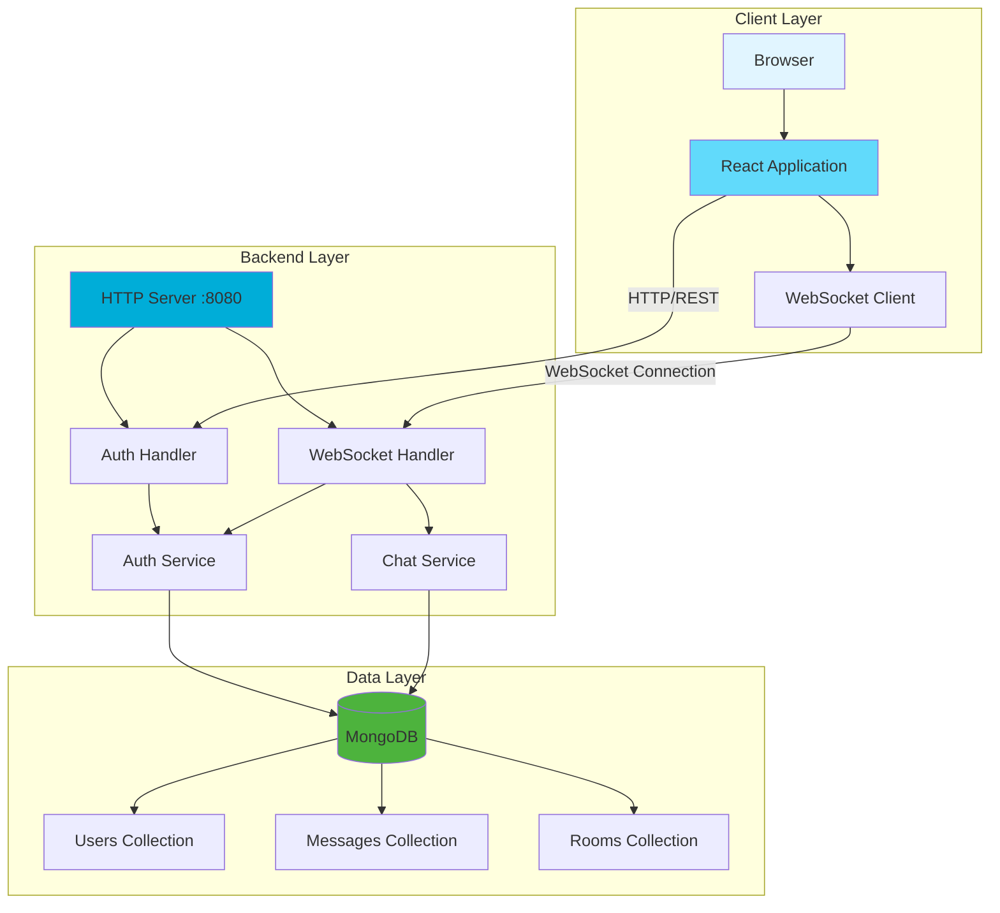
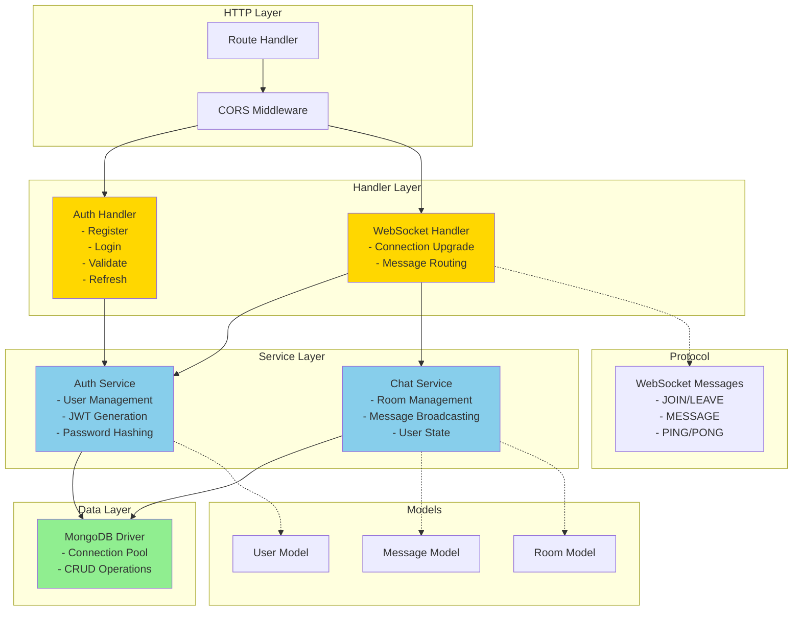
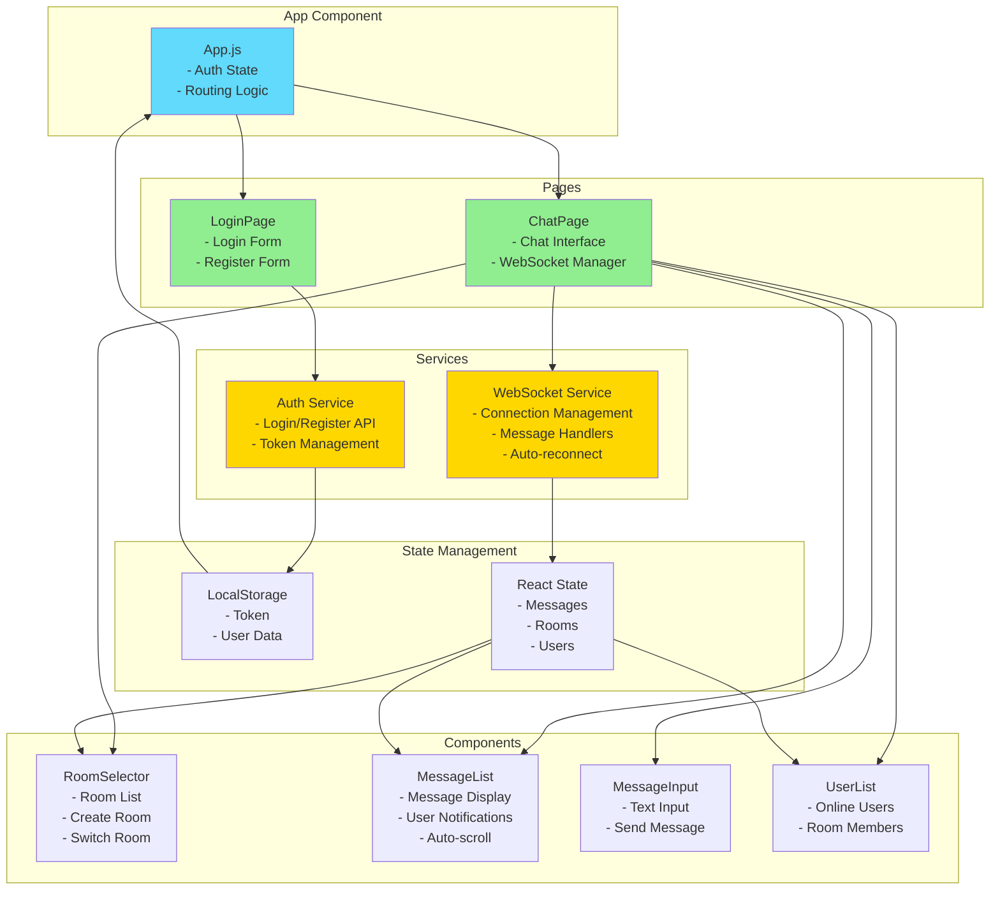
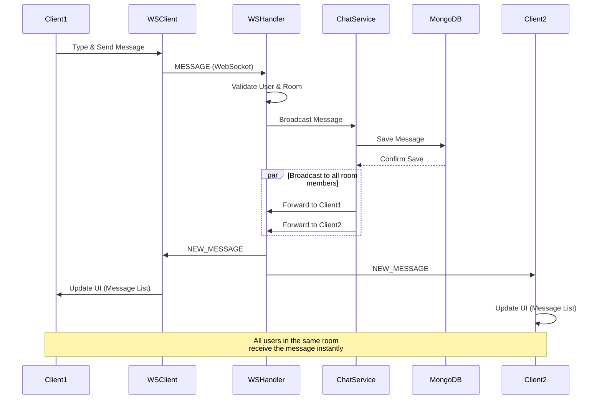

# GoChat: Real-time Multi-room Chat Application

A full-stack, real-time chat application built with Go and React, demonstrating robust server-side concurrency, WebSocket communication, and distributed data persistence.

## Overview

GoChat allows multiple users to connect, join various chat rooms, and exchange messages instantly. The application emphasizes understanding the core mechanics of real-time network applications and scalable backend design, utilizing Go's powerful concurrency features and modern web technologies.

## Problem Statement

Traditional request-response models (like standard HTTP) are inefficient for real-time, interactive communication. Building a chat application requires:

- Persistent, bi-directional connection between clients and server
- Instant message delivery to all relevant participants
- Efficient handling of thousands of concurrent connections
- Race condition-free shared state management
- Reliable message and user data persistence

## Key Features

### Backend (Go)

- **Multi-Client Concurrency**: Handles thousands of simultaneous connections using Go's goroutines and channels
- **WebSocket Communication**: Persistent, full-duplex communication using `github.com/gorilla/websocket`
- **Room Management**: Dynamic room creation/joining with member state tracking
- **User Authentication**: JWT-based authentication with secure password hashing and salt
- **Message Broadcasting**: Efficient room-based message distribution
- **Data Persistence**: MongoDB integration for users, rooms, and message history
- **Error Handling**: Graceful handling of disconnections and network issues
- **Clean Protocol**: JSON-based WebSocket protocol with comprehensive message types
- **CORS Support**: Cross-origin resource sharing for web frontend integration
- **Health Monitoring**: Built-in health check and API info endpoints

### Frontend (React)

- **Intuitive UI**: Modern, responsive interface
- **Real-time Updates**: Instant chat feed updates via WebSockets
- **Authentication Forms**: User registration and login
- **Room Management**: Easy room switching and creation
- **User Lists**: Display of currently online room members
- **Message History**: Automatic loading of recent room messages
- **Auto-reconnection**: Automatic WebSocket reconnection on connection loss
- **Responsive Design**: Mobile-friendly interface with adaptive layouts
- **Real-time Notifications**: User join/leave notifications and typing indicators

## Architecture

### System Architecture Overview



### Backend Architecture (Go)



### Frontend Architecture (React)



### Real-time Message Flow



## Technical Implementation

### Concurrency Model

- **Goroutines**: Lightweight threads for each client connection
- **Channels**: Type-safe communication between goroutines
- **Mutexes**: Protection of shared data structures from concurrent access

### Data Model (MongoDB)

**Users Collection:**

```json
{
  "_id": "user_id_uuid",
  "username": "unique_username",
  "password_hash": "hashed_password",
  "salt": "salt_value",
  "created_at": "timestamp"
}
```

**Messages Collection:**

```json
{
  "_id": "message_id_uuid",
  "room_name": "general",
  "sender_username": "user123",
  "message_content": "Hello everyone!",
  "timestamp": "iso_datetime"
}
```

**Rooms Collection:**

```json
{
  "_id": "room_id_uuid",
  "name": "room_name",
  "created_at": "timestamp",
  "creator_id": "user_id_uuid"
}
```

## 📋 Prerequisites

- Go (version 1.19 or higher)
- Node.js & npm
- MongoDB instance (local or remote)
- Git

## Installation & Setup

### Backend Setup

1. **Clone the repository:**

   ```bash
   git clone https://github.com/your-username/gochat-realtime-messaging.git
   cd gochat-realtime-messaging/backend
   ```

2. **Configure MongoDB:**
   Ensure your MongoDB instance is running. The server will use `mongodb://localhost:27017` by default, or set the `MONGO_URI` environment variable.

3. **Install dependencies:**

   ```bash
   go mod tidy
   ```

4. **Set environment variables (optional):**
   ```bash
   export MONGO_URI="mongodb://localhost:27017"
   export PORT="8080"
   ```

5. **Run the server:**
   ```bash
   go run main.go
   ```
   Server will listen on `localhost:8080` by default.

### Frontend Setup

1. **Navigate to frontend directory:**

   ```bash
   cd ../frontend
   ```

2. **Install dependencies:**

   ```bash
   npm install
   ```

3. **Start development server:**
   ```bash
   npm start
   ```
   Application will open at `localhost:3000`.

## Usage

1. Ensure both backend and frontend are running
2. Navigate to `localhost:3000` in your browser
3. Register a new user account
4. Log in with your credentials
5. Join existing rooms or create new ones
6. Start chatting! Open multiple tabs to simulate multiple users

## API Endpoints

### Authentication Endpoints

- `POST /api/auth/register` - Register a new user
- `POST /api/auth/login` - Login with username and password
- `POST /api/auth/validate` - Validate JWT token (requires Authorization header)
- `POST /api/auth/refresh` - Refresh JWT token (requires Authorization header)

### Utility Endpoints

- `GET /api/health` - Health check endpoint
- `GET /api/info` - API information and available endpoints

### WebSocket Endpoint

- `WS /ws?token=<jwt_token>` - Real-time chat connection

### WebSocket Message Types

**Client to Server:**
- `JOIN` - Join a chat room
- `LEAVE` - Leave current room
- `MESSAGE` - Send a chat message
- `PING` - Connection health check

**Server to Client:**
- `JOINED_ROOM` - Confirmation of room join
- `LEFT_ROOM` - Confirmation of room leave
- `NEW_MESSAGE` - New chat message broadcast
- `USER_JOINED` - User joined room notification
- `USER_LEFT` - User left room notification
- `USER_LIST` - Current users in room
- `ROOM_HISTORY` - Historical messages for room
- `ERROR` - Error message
- `PONG` - Response to ping

## Project Structure

```
gochat-realtime-messaging/
├── backend/
│   ├── main.go               # Server entry point
│   ├── handlers/             # HTTP and WebSocket handlers
│   │   ├── auth.go
│   │   └── websockets.go
│   ├── models/               # Data structures
│   │   ├── user.go
│   │   ├── message.go
│   │   └── room.go
│   ├── services/             # Business logic
│   │   ├── auth_service.go
│   │   └── chat_service.go
│   ├── db/                   # MongoDB operations
│   │   └── mongo.go
│   ├── protocol/             # WebSocket message types
│   │   └── messages.go
│   ├── utils/                # Utility functions
│   │   └── auth.go
│   ├── go.mod
│   └── go.sum
├── frontend/
│   ├── public/
│   ├── src/
│   │   ├── App.js            # Main React component
│   │   ├── components/       # Reusable UI components
│   │   ├── pages/            # Page components
│   │   ├── services/         # WebSocket client logic
│   │   │   └── websocket.js
│   │   ├── styles/           # CSS files
│   │   └── index.js
│   ├── package.json
│   └── README.md
└── README.md
```

## Learning Outcomes

This project provides hands-on experience with:

- **Concurrent Programming in Go**: Mastering goroutines and channels
- **WebSocket Protocol**: Implementing bi-directional, persistent communication
- **Server-Side State Management**: Managing connected clients and rooms safely
- **NoSQL Integration**: Working with MongoDB for flexible data storage
- **Authentication Systems**: Implementing secure token-based authentication
- **Full-Stack Development**: Connecting Go backend with React frontend
- **Debugging Concurrent Systems**: Identifying and resolving race conditions
- **Real-time Web Applications**: Building responsive, event-driven user interfaces
- **JWT Authentication**: Implementing secure token-based authentication flows
- **React State Management**: Managing complex application state and side effects
- **WebSocket Client Development**: Handling connection management and reconnection logic
- **Responsive Web Design**: Creating mobile-friendly, adaptive user interfaces
- **RESTful API Design**: Structuring HTTP endpoints for authentication and data access

## Contributing

1. Fork the repository
2. Create a feature branch
3. Commit your changes
4. Push to the branch
5. Open a Pull Request

## 📄 License

This project is licensed under the MIT License - see the [LICENSE](LICENSE) file for details.

## 📞 Support

If you encounter any issues or have questions, please open an issue on GitHub or contact the maintainers.
